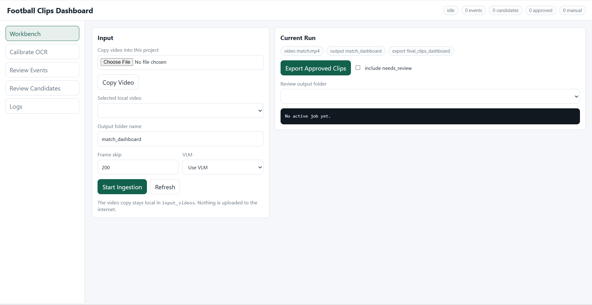

# Football Clips Ingestion

Reliability-first Python ingestion for football match videos. The system takes a local match video, detects football events and candidate moments, creates clips, and lets you review/export approved clips from a local dashboard.

The current workflow is dashboard-first:

1. Copy or select a local video.
2. Calibrate the scoreboard score digit boxes.
3. Start ingestion.
4. Watch progress logs.
5. Review events and raw candidates.
6. Export approved clips.

Nothing is uploaded by the dashboard. Video copy/upload means browser-to-local-server copy into this project.



## What It Detects

The engine combines deterministic signals with optional VLM validation:

- Scoreboard OCR for score changes and goals.
- Goal celebration clips derived from scoreboard-confirmed goals.
- Audio energy and crowd spike evidence.
- Scene cuts and replay-like candidates.
- Stoppage candidates such as cards, substitutions, injuries, referee/player discussion.
- Skill/dribble/trick/duel candidates.
- Shot/chance/save/cross/key-pass candidates.
- Broadcast text/graphic candidates when VLM is enabled.

Scoreboard-confirmed goals are deterministic. Other event families are candidate clips until reviewed or promoted by VLM/manual review.

## Install

```powershell
python -m venv .venv
.\.venv\Scripts\Activate.ps1
python -m pip install -r requirements.txt
```

For editable development installs, this is also supported:

```powershell
python -m pip install -e .[ocr]
```

You also need `ffmpeg` available on `PATH` for clipping. The `imageio-ffmpeg` package can provide an ffmpeg binary for many workflows, but installing ffmpeg system-wide is still the most predictable setup.

### FFmpeg Setup

Official references:

- FFmpeg downloads: <https://www.ffmpeg.org/download.html>
- FFmpeg documentation: <https://www.ffmpeg.org/documentation.html>
- Windows builds linked from FFmpeg: <https://www.gyan.dev/ffmpeg/builds/>

Recommended install options:

Windows:

1. Install with Windows Package Manager if available:

```powershell
winget install "FFmpeg (Essentials Build)"
```

2. Or download an essentials/release build from the Windows builds page above, extract it, and add the extracted `bin` folder to your Windows `PATH`.

macOS with Homebrew:

```bash
brew install ffmpeg
```

Ubuntu/Debian Linux:

```bash
sudo apt update
sudo apt install ffmpeg
```

Fedora Linux:

```bash
sudo dnf install ffmpeg
```

Arch Linux:

```bash
sudo pacman -S ffmpeg
```

Verify installation:

```bash
ffmpeg -version
```

If the shell says `ffmpeg` is not recognized or not found, restart the terminal after updating `PATH`, then run the verification command again.

### PaddleOCR / PaddlePaddle Notes

`paddleocr` depends on `paddlepaddle`, and `paddlepaddle` can be sensitive to Python version, operating system, CPU/GPU build, and CUDA version. If `pip install -r requirements.txt` fails while installing `paddlepaddle`, the rest of the project may be fine; only OCR setup needs attention.

Recommended fixes:

- Use a supported Python version, preferably Python 3.10 or 3.11.
- Upgrade packaging tools first:

```powershell
python -m pip install --upgrade pip setuptools wheel
```

- Try installing the CPU build directly:

```powershell
python -m pip install paddlepaddle
```

- If you use GPU/CUDA, install the PaddlePaddle build that matches your CUDA version from the official PaddlePaddle installation selector.
- After PaddlePaddle installs successfully, rerun:

```powershell
python -m pip install -r requirements.txt
```

Quick verification:

```powershell
python -c "import paddle; import paddleocr; print('paddle ok')"
```

## Start The Dashboard

```powershell
.\run_dashboard.ps1
```

Or run it directly:

```powershell
.\.venv\Scripts\python.exe dashboard.py --open
```

Open:

```text
http://127.0.0.1:7860
```

The dashboard has:

- `Workbench`: copy/select a video, choose output name, set frame skip, enable/skip VLM, start ingestion, export clips.
- `Calibrate OCR`: seek to a frame with visible score digits and draw OCR boxes.
- `Review Events`: review linked/promoted events.
- `Review Candidates`: review raw candidate clips and manually approve/reject them.
- `Logs`: inspect timestamped job logs.

## Configuration

Runtime defaults live in:

```text
config.json
```

Important sections:

- `vlm`: model name, OpenAI-compatible API base URL, optional API key environment variable.
- `dashboard`: host, port, input/output/export folders.
- `ingestion`: OCR engine, team codes, frame skip, candidate limits, goal/celebration clip windows.
- `broadcast_text`: VLM broadcast overlay scan sampling.
- `validation`: VLM validation confidence and frames per clip.

Command-line flags still override config values for one-off runs.

## VLM Setup

VLM use is optional. If you select `Skip VLM` in the dashboard, ingestion skips:

- broadcast text scanning
- VLM validation

No VLM server or API key is needed in that mode.

If VLM is enabled, you must start the VLM server yourself before ingestion for local VLMs. The code does not load models automatically.

For a local OpenAI-compatible server:

```json
"vlm": {
  "model": "qwen/qwen3-vl-4b",
  "api_base": "http://localhost:1234/v1",
  "api_key_env": ""
}
```

For a remote OpenAI-compatible API:

```json
"vlm": {
  "model": "gpt-4.1-mini",
  "api_base": "https://api.openai.com/v1",
  "api_key_env": "OPENAI_API_KEY"
}
```

Or set the key in PowerShell before starting the dashboard or ingestion:

```powershell
$env:OPENAI_API_KEY="your_key_here"
```

When VLM is enabled, ingestion preflights the configured API near the start of the run and fails fast if the API/key/model is not reachable.

## OCR Calibration

Use the dashboard's `Calibrate OCR` tab for each video.

Crop rules:

- `Left Score`: crop only the left team's numeric score digit.
- `Right Score`: crop only the right team's numeric score digit.
- Do not include team names, flags, match clock, separators, labels, or the whole scoreboard banner.
- Pick a frame where both digits are sharp, visible, and not mid-animation.
- You do not need to provide digit examples. The selected boxes are read directly by OCR.
- For penalty shootout graphics, crop shootout score digits only if you intentionally want OCR on that overlay.

Dashboard calibration is temporary. It is written under `calibration/dashboard/<video-name>` during a run and cleaned up after ingestion.

## Running Ingestion Without The Dashboard

The dashboard is the recommended path, but the main script can still be run directly:

```powershell
.\.venv\Scripts\python.exe main.py --video path\to\match.mp4 --output clips\match_run --skip-validation --skip-broadcast-text
```

For VLM-enabled runs, make sure `config.json` points to a working OpenAI-compatible API, or pass overrides:

```powershell
.\.venv\Scripts\python.exe main.py --video path\to\match.mp4 --output clips\match_run --api-base http://localhost:1234/v1 --model qwen/qwen3-vl-4b
```

Shell runs print timestamped progress lines, including OCR reads, detector progress, step durations, and VLM validation timing when enabled.

## Output Folders

Working ingestion outputs are stored under:

```text
clips/<run-name>/
```

A run folder can contain:

```text
manifest.json
timeline_ocr.csv
timeline_ocr.json
audio_energy.csv
audio_energy.json
scene_cuts.csv
replay_candidates.csv
stoppage_candidates.csv
stoppage_candidates.json
skill_candidates.csv
skill_candidates.json
chance_candidates.csv
chance_candidates.json
broadcast_text_candidates.csv
broadcast_text_candidates.json
goal/
goal_celebration/
review_required/
validation/
linked_events.json
linked_events/
review_decisions.json
candidate_decisions.json
run_report.json
run_report.html
```

`clips/<run-name>` is a working/review folder. It contains all generated clips and metadata, not just final approved clips.

Approved exports are stored under:

```text
final_clips_dashboard/<run-name>/
```

You can delete old folders inside `clips` and `final_clips_dashboard` when you no longer need their review state or exports. Keep `.runtime_home` cache folders if you want to avoid re-downloading OCR models.

## Review And Export

The dashboard reads review data from `clips/<run-name>`.

- Review decisions are saved to `review_decisions.json`.
- Candidate decisions are saved to `candidate_decisions.json`.
- Export uses the selected review folder and writes approved clips to `final_clips_dashboard`.

Manual approval in `Review Candidates` can promote a raw candidate clip into an exported event.

## Event Labels

The event taxonomy lives in:

```text
football_ingest/labels.py
```

It includes goals, penalties, cards, set pieces, shots, goalkeeper actions, defensive actions, passing/crossing actions, skills/dribbles, reactions, VAR, and review states.

The VLM validator also supports non-promotable outcomes such as `no_event` and `uncertain`.

## Project Layout

```text
dashboard.py              Local web dashboard.
main.py                   Full ingestion pipeline orchestrator.
config.json               Runtime defaults.
run_dashboard.ps1         Dashboard launcher.
export_approved.py        Dashboard export helper.
review_ui.py              Shared review payload/decision helpers used by dashboard.
football_ingest/          Core detection, OCR, clipping, linking, validation, reporting modules.
scripts/smoke_test.py     Lightweight regression smoke test.
input_videos/             Local copied/selected videos.
clips/                    Working run outputs.
final_clips_dashboard/    Exported approved clips.
```

## Tests

Run the smoke test:

```powershell
.\.venv\Scripts\python.exe scripts\smoke_test.py
```

Compile-check the active code:

```powershell
.\.venv\Scripts\python.exe -m compileall main.py dashboard.py review_ui.py export_approved.py football_ingest scripts
```

Validate config JSON:

```powershell
.\.venv\Scripts\python.exe -m json.tool config.json
```

## Reliability Notes

The system is intentionally conservative:

- Goals come from parsed score increases, not broad visual guessing.
- Raw OCR reads are retained for audit.
- Non-scoreboard event families are candidate clips until VLM/manual review promotes them.
- VLM runs on short candidate windows, not the full match.
- Dashboard logs include progress and step durations so long runs are inspectable.
